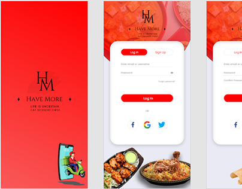

# 🍲 HaveMore Design System

**Futuristic UI/UX & Branding for Food Delivery and Hospitality Platforms**

---

## 📋 Overview

This repository contains the unified design system and branding assets for **HaveMore**—a smart, modern food delivery and restaurant experience.  
It serves as the home for all high-fidelity assets, component guidelines, and visual identity essentials, ensuring a cohesive customer journey from onboarding to checkout.

---

## 🚀 Key Features

- **Premium Branding** — Professional logo, color palette, and typography for instant brand recall
- **Onboarding & Auth Screens** — Striking red gradients, dynamic food illustration, and social logins for seamless user onboarding
- **Custom Iconography** — Scalable icons tuned for mobile and web clarity
- **Component Library** — Buttons, forms, cards, and navigation elements exported for developer use
- **Developer Documentation** — Ready-to-follow guidelines for smooth UX implementation and consistent product releases
- **Production‑Ready Exports** — Assets in PNG, SVG, and PDF for any design or development context

---

## 🎨 Design Highlights

- Crafted with **Adobe XD** and **Figma** for collaborative workflows
- Visually bold, red‑forward identity, capturing brand energy
- Food photography and illustration blend for appetizing effect
- UX flows optimized for sign up, log in, and ordering ease
- Consistent layout grid, touch targets, and adaptive styles

---

## 📸 Main Preview

**Brand Splash, Login/Sign-up, and Menu Highlights**  

---

## 📁 Repository Structure

havemore-design/
├── assets/
│ ├── logos/ # Brand logo files (PNG, SVG, PDF)
│ └── icons/ # Custom icon sets and individual SVGs
├── screens/
│ ├── onboarding/ # Splash, login, signup, and auth screens
│ ├── menu/ # Food/category pages, product UI
│ └── cart-checkout/ # Cart, order summary, and checkout flows
├── exports/
│ ├── png/ # Exported PNGs for rapid prototyping
│ ├── svg/ # Exported vector SVGs for web/app
│ └── pdf/ # Print-ready and documentation files
├── documentation/
│ ├── specs.md # Developer-focused design/system guidelines
│ ├── colors.md # Color palette, gradients, and code refs
│ └── typography.md # Fonts, type scale, font-weight rules
└── README.md
---

## 🌐 Showcased On

**[Behance Project – HaveMore Design System](https://www.behance.net/pranaykumar23)**  
Complete feature tour, process breakdown, and live UI interactions.

---

## 👤 Author

[Pranay Kumar](https://github.com/mudigondapranay)  
[Behance Portfolio](https://www.behance.net/pranaykumar23)  
[LinkedIn](https://www.linkedin.com/in/mudigondapranay/)

---

## 🤝 Contributing

HaveMore design is maintained by the design team and open to collaboration—  
- Please follow repo structure and commit conventions
- Update documentation on each significant asset or UX flow change
- Fork and PR to submit improvements!

---

## ⚡ License

All assets proprietary to HaveMore.  
Intended for official, internal, or licensed use only. Please request permission for external projects.

---

> _Delighting users, one modern meal at a time—through design and experience._

